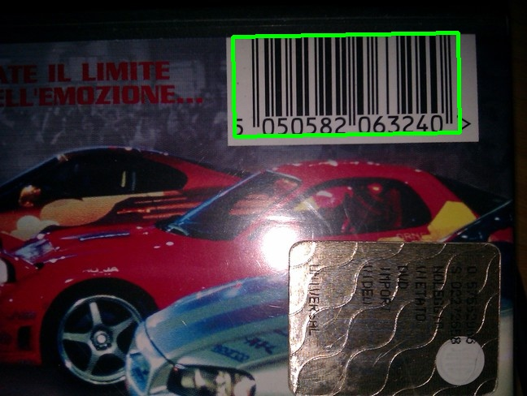
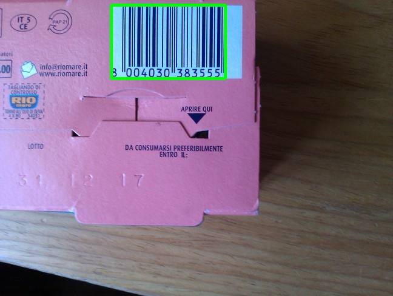
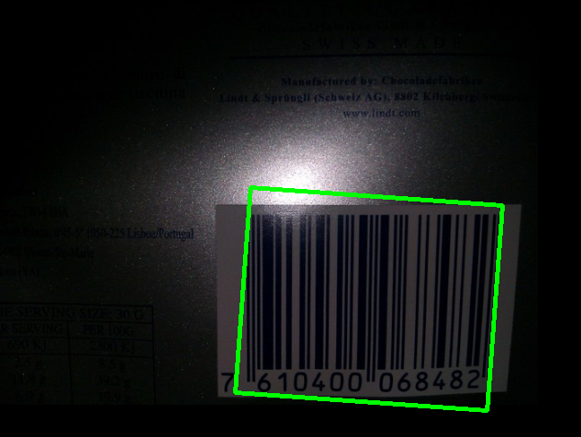
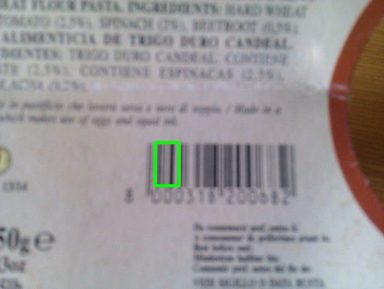
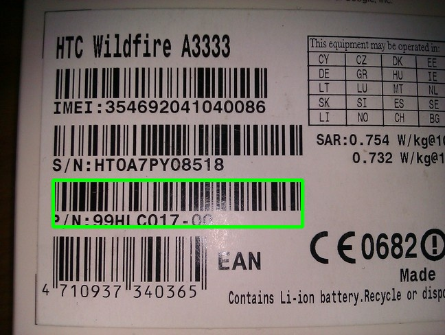
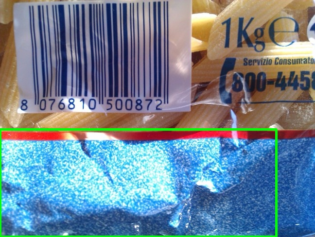
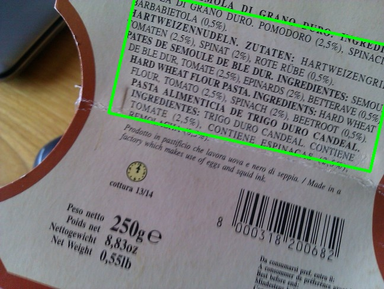

# 1D Barcode Detection
Detect barcode in the image or via web camera. Use image processing techniques. 

## Description


## Sneak Peek





## Setup 
To run this project on <b> Linux</b> type in your terminal:

```bash
$ git clone https://github.com/AleksandraPestka/Barcode-detection-1D.git
```
Use the package manager <b>pip</b> to install requirements (virtualenv recommended)
```bash
$ pip install -r requirements.txt
```
Move to script folder
```bash
$ cd scripts
```
Run project using your locally saved images <br>(DATA_DIRECTORY: path to folder which contains your images, SAVE_DIRECTORY (optionally): path to folder to save processed images):
```bash
$ python main.py -m Locally -d DATA_DIRECTORY -s SAVE_DIRECTORY
```

Or run project in real-time using web camera
```bash 
$ python main.py -m Real-time
```
## Difficulties
The algorithm is not sufficiently robust to:
- blurry images<br>

- images with many barcodes<br>

- images with granulated structure<br>

- images with a lot of text (no zoom in on barcode) <br>


## Author
Created by Aleksandra Pestka

## Sources
This project is inspired by the blog post: <br>
- https://www.pyimagesearch.com/2014/11/24/detecting-barcodes-images-python-opencv/

<br> The source of the dataset is credited to: <br>
- Robust Angle Invariant 1D Barcode Detection
Alessandro Zamberletti, Ignazio Gallo and Simone Albertini
Proceedings of the 2nd Asian Conference on Pattern Recognition (ACPR), Okinawa, Japan, 2013

<br> Other publication: <br>
- Neural Image Restoration For Decoding 1-D Barcodes Using Common Camera Phones
Alessandro Zamberletti, Ignazio Gallo, Moreno Carullo and Elisabetta Binaghi
Computer Vision, Imaging and Computer Graphics. Theory and Applications, Springer Berlin Heidelberg, 2011

